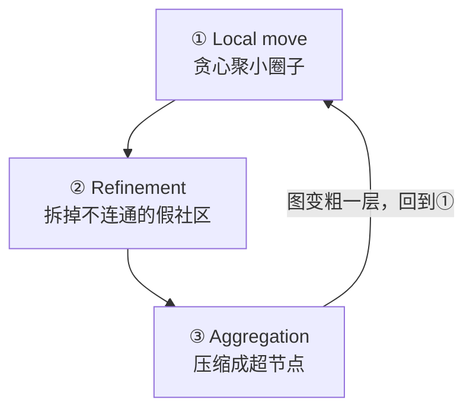

# Leiden 社区检测算法（GraphRAG 核心）

## 概述

GraphRAG 建图后，用 **Leiden 算法**把图切成一层层的"社区"（社区 = 内部关系密集、对外关系稀疏的节点集合）。Leiden 是 Louvain 的改进版，核心优势是**保证社区内部连通**。

每轮迭代分三个阶段，循环产生分层（level 0 / 1 / 2）：



---

## ① Local move（局部移动）：节点贪心跳槽

**初始化**：每个节点自己一个社区。然后按随机打乱的顺序，逐个节点看"要不要跳到邻居的社区"。

以三国为例（边：刘备-关羽-张飞两两相连 / 曹操-夏侯惇 / 孙权-吕蒙 / 貂蝉-吕布）：

```
刘备 → 跳进 {关羽}         → {刘备, 关羽}
张飞 → 跳进 {刘备, 关羽}    → {刘备, 关羽, 张飞}
曹操 → 跳进 {夏侯惇}        → {曹操, 夏侯惇}
孙权 → 跳进 {吕蒙}          → {孙权, 吕蒙}
```

一轮扫完再从头发，直到**没有任何节点再移动**（收敛）。

### 判据：模块度增量 ΔQ

跳不跳只看这一个公式：

```
ΔQ(v → C) = k_{v,C} / 2m  -  γ · (Σ_tot · k_v) / (2m)²
```

| 符号 | 含义 |
|------|------|
| `k_{v,C}` | 节点 v 到社区 C 的边权总和 |
| `Σ_tot` | 社区 C 的总度数 |
| `k_v` | 节点 v 的度数 |
| `m` | 全图总边权 |
| `γ` | resolution 参数（GraphRAG 默认 1.0） |

**直觉**：前半项是"v 和 C 实际连得多紧"，后半项是"随机图里本该连多紧"。ΔQ > 0 意味着比随机更紧，值得合并。所以三角形（内部边密度远高于随机期望）会聚成一个社区；而彼此无边相连的节点永远不会往对方社区跳。

---

## ② Refinement（细化）：拆掉贪心造成的"不连通假社区"

Leiden 相对 Louvain 的**唯一本质改进**。local move 是贪心的，只判断"跳过去模块度涨不涨"，**不判断跳过去之后社区内部连不连通**，所以可能产出内部断开的社区：

```
local move 结束时（错误）：{曹操─夏侯惇} + {孙权─吕蒙} 被归成"同一个社区"
                          ↑ 这两坨之间其实没边，内部不连通
```

Refinement 把每个社区当子图再跑一遍局部移动，拆到**每个社区内部连通**为止：

```
{曹操,夏侯惇,孙权,吕蒙}  ── refinement ──►  {曹操,夏侯惇} + {孙权,吕蒙}
```

### 三个刹车（任一不满足就不拆）

1. **连通约束**：节点 v 挪走后，原社区剩余节点仍须连通（v 不能是割点）。
2. **well-connected（良连接）**：拆出的社区须存在核心子集 S，S 内部连接紧密，且社区里每个节点都连到 S。→ 防止拆出孤点散沙。
3. **模块度增益 > 0**：拆了要变好才拆。

**单遍遍历**：每个节点按随机顺序只被处理一次，不是 local move 那种"扫到不动"的无限循环，所以**不会一直拆**。

### 拆 vs 不拆的例子

```
不拆（三角形）：拆出张飞 → {张飞} 孤点 + 损失内部边 → 增益 < 0 → 不拆

拆（哑铃型，只有一条桥边）：
  刘备─关羽        曹操─夏侯惇
        \         /
         关羽──曹操   ← 唯一桥边
  → 关羽是割点，断开桥边 → {刘备,关羽,张飞} + {曹操,夏侯惇}，增益 > 0 → 拆
```

---

## ③ Aggregation（聚合）：压缩成超节点

每个社区收缩成一个**超节点**，社区之间的边合并成超节点间的边（权重累加），社区内部的边变成自环：

| 原始边 | 聚合后 |
|--------|--------|
| 刘备-关羽、刘备-张飞、关羽-张飞 | 「蜀汉」超节点自环，权重 = 3 条边之和 |
| 蜀汉和东吴之间的边（如有） | 「蜀汉」↔「东吴」一条边，权重累加 |

图变粗一层，回到 ① 再跑。

---

## 分层来源

每循环一轮 ①②③ → 图粗一层 → 一个新的 community level：

```
level 0（最粗）：魏蜀吴合并成"群雄"级别大社区
level 1        ：蜀汉 / 曹魏 / 东吴 / 独立对
level 2（最细）：蜀汉内部 → 核心圈 / 武将圈
```

GraphRAG 的循环停止条件：带着 `max_cluster_size` 参数（默认 10），某层社区大小超过 10 就继续下钻聚合，都 ≤ 10 就停。

**一句话记忆**：local move 负责聚，refinement 负责修，aggregation 负责缩，三者循环出分层。

---

## 源码位置

`graphrag/index/operations/cluster_graph.py` → 调 `hierarchical_leiden(edge_list, max_cluster_size, random_seed)`，Rust 实现（`graspologic`）。用户可调参数只有 `max_cluster_size` / `random_seed`，γ 和 randomness 用默认值。
