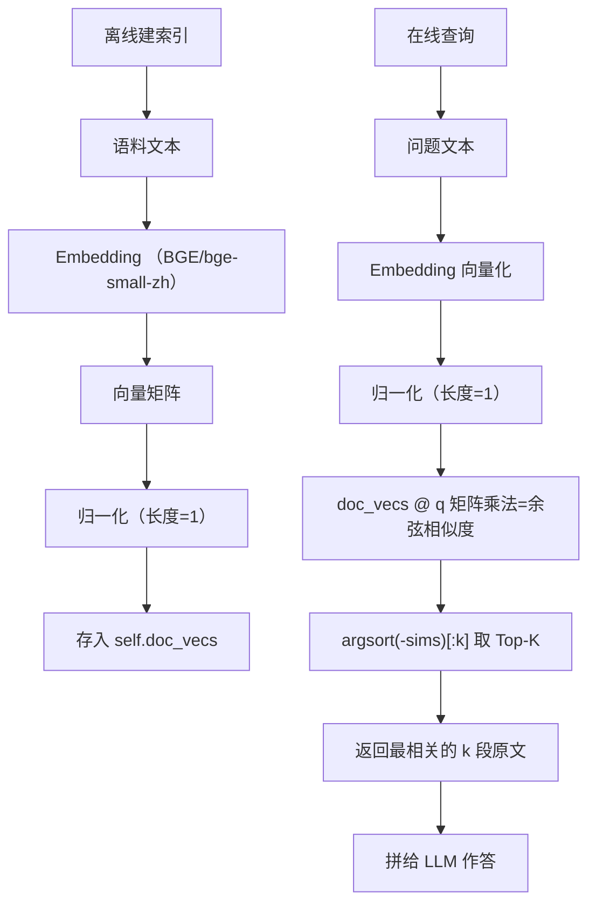

# 📌 Vector RAG（向量检索增强生成）

## 概述

Vector RAG 是最经典的 RAG 方案：**将文本向量化 → 语义相似度检索 → 拼上下文给 LLM**。核心思想是把语义相似的文本映射到向量空间中相近的位置，检索时找最近邻居。

## 核心流程



## 关键公式：余弦相似度

### 几何定义

```
A · B = |A| × |B| × cos(θ)
```

两个向量的点积 = 各自长度 × 夹角的余弦值。

### 代数定义（坐标公式）

```
A · B = x₁x₂ + y₁y₂ + z₁z₂
```

对应坐标相乘再求和。

### 推导出余弦相似度

两个定义计算的是同一个东西（点积），将它们连起来：

```
|A| × |B| × cos(θ) = x₁x₂ + y₁y₂

cos(θ) = (x₁x₂ + y₁y₂) / (|A| × |B|)
```

**几何定义告诉我们"为什么要算 cos(θ)"（方向一致 = 语义相似），代数定义告诉我们"机器怎么算"（没有量角器，只有坐标数字）。**

### 为什么除以长度

文本 embedding 模型训练的目标是**让同话题的向量指向同一方向**，长度是被动的副产品：

```
"万达是房地产公司"                         → [0.8, 0.6, 0.0]   长度=1.0
"万达是房地产公司。万达是房地产公司"（重复） → [1.6, 1.2, 0.0]   长度=2.0
```

语义完全一样，向量可以差一倍。不除以长度的话，长的向量点积更大，会错误地排到前面。除以长度**剔除长度干扰，只保留方向信息（语义）**。

## 归一化预处理的优化

原始余弦公式每次计算要做两次除法和一次除法：

```
cos(A, B) = (A · B) / (|A| × |B|)
```

提前把文档和查询向量都归一化（长度=1），分母恒为 `1 × 1 = 1`，省掉除法：

```python
# 建索引时归一化全部文档向量
norms = np.linalg.norm(vecs, axis=1, keepdims=True) + 1e-12
self.doc_vecs = vecs / norms

# 查询时归一化问题向量
q = q / (np.linalg.norm(q) + 1e-12)

# 直接点积就是余弦相似度
sims = self.doc_vecs @ q  # 一次矩阵乘法，千级别向量一次算完
```

## Demo 代码逐行解析

```python
class VectorRAG:
    def __init__(self, corpus: list[str]):
        self.corpus = corpus                                      # 存原始文本
        vecs = np.array(embed_texts(corpus), dtype=np.float32)    # 所有文本向量化 (N×768)
        norms = np.linalg.norm(vecs, axis=1, keepdims=True) + 1e-12  # 每行长度
        self.doc_vecs = vecs / norms                              # 归一化，都变单位向量

    def retrieve(self, question: str, k: int = 3):
        q = np.array(embed_texts([question])[0], dtype=np.float32)  # 问题向量化
        q = q / (np.linalg.norm(q) + 1e-12)                         # 归一化
        sims = self.doc_vecs @ q                                     # 一次算出所有相似度
        order = np.argsort(-sims)[:k]                                # 取相似度最高的 k 个索引
        return [(int(i), float(sims[i]), self.corpus[i]) for i in order]
```

| 步骤 | 作用 |
|------|------|
| `embed_texts(corpus)` | 调本地 BGE 模型，文本 → 768 维向量 |
| `np.float32` | 32 位浮点（省一半内存，精度够用） |
| `np.linalg.norm(axis=1)` | 算每行的勾股长度 √(x₁² + x₂² + ...) |
| `+ 1e-12` | 防除以 0（全零向量安全兜底） |
| `vecs / norms` | numpy 广播：每行除以该行的长度 |
| `doc_vecs @ q` | 矩阵乘法，等于每个文档向量和 q 的点积 |
| `argsort(-sims)[:k]` | 取负值因为 argsort 默认升序，取负后最大的排最前 |

## 生产环境的缩放

| 方案 | 规模 | 搜索方式 |
|------|------|----------|
| 暴力搜索（Demo） | < 1 万 | 逐个算余弦，O(N) |
| HNSW | 百万级 | 多层图大跳逼近，O(logN) |
| Faiss IVF | 千万级 | 先聚类再搜，O(√N) |

核心逻辑不变（文本→向量→找最近邻居），变的是"怎么找"——从全扫描换成近似最近邻（ANN）。

## numpy 核心操作速查

| 操作 | 含义 |
|------|------|
| `np.array(list)` | 列表 → numpy 数组 |
| `np.float32` | 32 位浮点数类型 |
| `np.linalg.norm(arr, axis=1)` | 逐行算向量长度（模） |
| `keepdims=True` | 保持二维形状，方便广播 |
| `vecs / norms` | numpy 广播：逐行相除 |
| `mat @ vec` | 矩阵乘法（`@` 运算符） |
| `np.argsort(arr)` | 返回排序后的索引（默认升序） |

---

> Vector RAG 的核心是"语义相似的文本在向量空间里挨得近"，然后用余弦相似度量化"挨得多近"。
