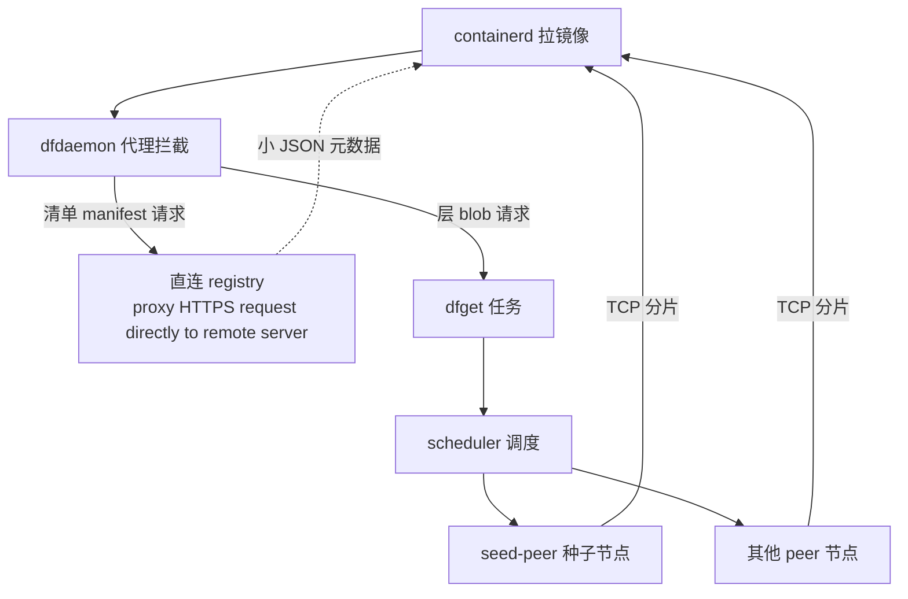

# Dragonfly 镜像加速（P2P 分发）实战

> Dragonfly 是 CNCF 孵化项目，解决大规模集群拉取同一大镜像时 registry 被打爆的问题。
> 本文记录架构原理、dfdaemon 双通道机制、P2P 验证 SOP，以及 TCE（bran-gr2）环境的实战坑。
> 项目侧（TKE 控制台镜像加速白屏前端）的实现要点见 [集群管理控制台 · 镜像加速模块](/topics/projects/cluster-console/)。

## 一、镜像加速是什么

镜像加速 = **Dragonfly（P2P 分发）** + **Nydus（镜像懒加载）** 组合，作为 TKE Addon 部署。

- **痛点**：N 个节点同时拉同一个大镜像，每个节点都直连 registry → registry 带宽/连接数被打爆，且节点间重复传输浪费。
- **Dragonfly 解法**：首个节点（seed-peer）从 registry 拉全量并缓存，其余节点从它（peer）经 P2P 拉分片，registry 只服务一个节点。
- **Nydus 懒加载**：镜像不整体下载，只按需拉启动所需文件（需 containerd **1.7.0+**，否则不支持）。

## 二、组件架构

| 组件 | 职责 |
|------|------|
| manager | 控制台 / 全局配置 |
| scheduler | 调度：决定分片从哪个 peer 取 |
| seed-peer | 种子节点，首个拉取者，充当缓存源 |
| dfdaemon | 节点代理，拦截 containerd 的 registry 请求 |
| nydus-snapshotter | 懒加载快照器（Nydus 模式） |

⚠️ **实战纠正**：在 TKE Addon 里 dfdaemon **不是独立 DaemonSet**，而是作为容器打在 `dragonfly-nydus-xxxxx` pod 内（状态 `2/2` = dfdaemon + nydus-snapshotter 两容器），且**只在打了 `dragonfly.io/test=true` 的节点上运行**。看 dfdaemon 日志须 `-c dfdaemon`：
```bash
kubectl -n dragonfly-system get pods -o wide          # 找到 dragonfly-nydus-<hash>
kubectl -n dragonfly-system logs dragonfly-nydus-<hash> -c dfdaemon | grep <镜像名>
```

**拉取流程（dfdaemon 拦截）**：



## 三、dfdaemon 双通道（最容易误判的点）

containerd 拉镜像分两步走，dfdaemon 对两类请求走**不同路径**：

| 请求类型 | 体积 | 路径 | 日志特征 | 是否 P2P |
|----------|------|------|----------|----------|
| manifest（清单，HEAD/GET） | 几 KB JSON | 直连 registry | `proxy HTTPS request directly to remote server` | ❌ 不 P2P（正常） |
| blob（镜像层，真正占体积） | 大 | dfget → scheduler → peer | `download piece ... from parent "...seed-peer..." using protocol tcp` | ✅ P2P |

**关键结论**：日志里出现 `proxy HTTPS request directly to remote server` **不矛盾、不表示 P2P 失败**——它只是 manifest 直连通道。manifest 必须字节精确又极小，走 P2P 反而增加调度开销、没收益。真正加速发生在 blob 上。

**判定标准**：只要 dfdaemon 日志里 blob 出现 `from parent "...seed-peer..."`，P2P 就生效；manifest 的直连行是噪声，忽略即可。

**区分技巧**：看那行直连日志后面的 URL 路径——
- `/v2/.../manifests/...` → 正常（清单直连）
- `/v2/.../blobs/sha256:...` 还走直连 → 才是异常（说明 registry 没进加速列表或 rule 未命中）

## 四、P2P 验证 SOP（bran-gr2 实测通过）

**前提**：configmap 里 `accelerationImageRegistries` 含测试镜像的 registry。
```bash
kubectl -n dragonfly-system get cm -o yaml | grep -iE "acceleration|mirrors|ccr"
# 确认如 ccr.d12-x86ver.fsphere.cn 出现在 registry.mirrors 注入 + ACCELERATION_REGISTRIES 循环
```

**步骤**：
1. 节点打标签（须连**业务集群** kubeconfig，非 global hub）：
   ```bash
   kubectl label node <节点IP> dragonfly.io/test=true
   ```
2. 提交测试 Pod，指定 `nodeName` 到带标签节点，`imagePullPolicy: Always` 保证重拉触发下载：
   ```yaml
   apiVersion: v1
   kind: Pod
   metadata:
     name: test-dragonfly-pull
     namespace: default
   spec:
     nodeName: 172.16.2.144
     restartPolicy: Never
     containers:
     - name: pause
       image: ccr.d12-x86ver.fsphere.cn/tkeimages/alpine:3.19-amd64
       imagePullPolicy: Always
       command: ["sleep", "3600"]
   ```
   > `command: ["sleep","3600"]` 只是让容器拉完镜像后挂起不退出，便于观察；与加速无关。
3. **当场实时**跟 dfdaemon 日志（关键！见下方坑）：
   ```bash
   kubectl -n dragonfly-system logs -f dragonfly-nydus-<hash> -c dfdaemon | grep -E "blobs|schedule|peer|dfget|task"
   ```

**成功判据**（bran-gr2 节点 172.16.2.54 实测）：
```
normal task response: ["172.23.2.69-dragonfly-seed-peer-50010001-1-...-seed"]
start to download piece ... from parent "...seed-peer..." using protocol tcp
finished piece ... from parent ... using protocol tcp
download task succeeded
```
seed-peer IP 172.23.2.69 = 节点 172.16.2.145 上的 dragonfly-seed-peer，即实测从 peer 经 TCP 拉分片，非直连 registry → **P2P 生效**。

**踩坑提醒**：
- 节点已缓存该镜像 → 重拉走本地缓存不触发 blob 下载。换未缓存节点或清缓存。
- dfdaemon/nydus pod 会重启 + 日志每 15min evict 滚动，几小时后再 `tail` 会丢实时下载记录 → **必须当场 `kubectl logs -f` 实时跟**，不要事后补看。

## 五、TCE 环境实战要点（bran-gr2）

- **子集群 CRD 不是 Clusternet 的 `mcls`**：TCE 用自研 `clusters`（缩写 `cls`，`clusters.infra.tce.io/v1`）。`kubectl get mcls` 报错；`kubectl get cls -A` 只列 `global`。
- **bran-gr2 未注册到 global hub**：它是独立 TKE 业务集群，hub 上没有它的 kubeconfig/节点信息。所有 dragonfly 命令须 `--kubeconfig ./bran-gr2.kubeconfig`（来源：TKE 控制台 → 基本信息/访问信息 → 下载），否则默认连 global 报 `namespace dragonfly-system not found`。
- **节点标签必须打在业务集群节点上**，绝不能在 global hub 上 label（标签会落到 global 节点，对 bran-gr2 无效）。
- **containerd 实测 1.6.9**（dfdaemon 日志 user-agent `containerd/v1.6.9-tke.6`）→ Nydus 懒加载不支持（需 1.7.0+），但 dfdaemon P2P 可测；MVP 验 **P2P only**。

## 六、日志判读速查

| 日志行 | 含义 | 是否正常 |
|--------|------|----------|
| `proxy HTTPS request directly to remote server` | manifest 直连 registry | ✅ 正常 |
| `proxy HTTP request via dfdaemon by rule config` | blob 命中加速规则，走 dfdaemon | ✅ 正常 |
| `normal task response: ["...seed-peer..."]` | scheduler 指定从 seed-peer 取 | ✅ P2P 调度中 |
| `from parent "...seed-peer..." using protocol tcp` | 实测从 peer 经 TCP 拉分片 | ✅ **P2P 铁证** |
| `download task succeeded` | blob 下载完成 | ✅ 成功 |
| 只有 manifest 直连日志、无任何 blob/scheduler/peer 日志 | 可能 registry 未进加速列表，或节点已缓存 | ⚠️ 需排查 |
