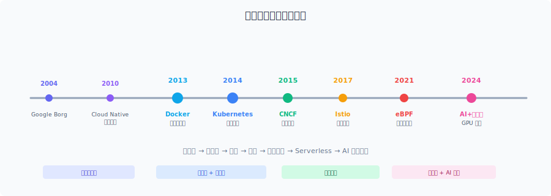

# 云原生概述与发展简史

## 什么是云原生

云原生（Cloud Native）是一种**从设计之初就为云环境而生**的应用构建和运行方法，充分利用云平台的弹性、分布式、自动化能力。

> 传统应用搬到云上只是"能跑"；云原生是天生适应云环境——弹性、自动化、快速迭代、高可用。

## 云原生解决的核心问题

| 痛点 | 云原生方案 | 关键技术 |
|------|-----------|---------|
| 环境不一致 "在我机器上能跑" | 容器化 | Docker、containerd |
| 手动扩缩容 | 弹性编排调度 | Kubernetes |
| 单体变更慢 | 微服务拆分 | 独立部署、独立迭代 |
| 发布周期长 | CI/CD 持续交付 | GitOps、Argo CD |
| 运维复杂度爆炸 | 统一可观测性 | Prometheus + Grafana + Jaeger |
| 基础设施耦合 | 声明式 + 不可变基础设施 | YAML 描述期望状态 |

## 对比：传统 vs 云原生

| 维度 | 传统方式 | 云原生 |
|------|---------|--------|
| 部署 | 手动装环境、拷文件 | 一个镜像到处跑 |
| 扩容 | 买服务器、装系统 | 自动弹出 Pod |
| 故障 | 人工发现、手动修 | 秒级自愈 |
| 发布 | 停机维护窗口 | 滚动更新零停机 |
| 周期 | 周/月级 | 分钟/秒级 |

## 核心技术栈

```
容器 (Docker) → 编排 (K8s) → 服务网格 (Istio)
    ↓                ↓              ↓
CI/CD (GitOps)   可观测性      微服务治理
```

## 发展简史

### 📅 时间线总览



> 如图片未加载，参见下方文字版时间线。

### 史前时代（2004–2012）：巨头内部实践

| 年份 | 事件 |
|------|------|
| **2004** | Google 内部启用 **Borg** 系统，管理数十万台服务器上的容器 |
| **2006** | AWS 发布 EC2/S3，云计算商用元年 |
| **2008** | Google 发布 **LXC**（Linux Containers），容器技术走向内核 |
| **2009** | Netflix 全面迁移 AWS，实践微服务 + 弹性架构 |
| **2010** | Paul Fremantle 首次使用 **"Cloud Native"** 一词 |
| **2011** | **12-Factor App** 发布，定义云应用设计原则 |

### 容器革命（2013–2014）：Docker 改变一切

| 年份 | 事件 |
|------|------|
| **2013.3** | **Docker** 发布，让容器从内核黑科技变成人人可用 |
| **2013** | Pivotal 的 Matt Stine 系统化提出云原生概念 |
| **2014.6** | Google 开源 **Kubernetes**（基于 Borg 10 年经验） |
| **2014** | 容器编排大战：Docker Swarm vs Mesos vs Kubernetes |

### 标准化时代（2015–2017）：K8s 一统天下

| 年份 | 事件 |
|------|------|
| **2015.7** | **CNCF** 成立，K8s 成为第一个托管项目 |
| **2016** | 各大云厂商推出托管 K8s（GKE/AKS/EKS/TKE） |
| **2017** | Docker 宣布支持 K8s，**编排之战结束** |
| **2017.5** | **Istio** 发布，Service Mesh 时代开启 |

### 全面爆发（2018–2020）

| 年份 | 事件 |
|------|------|
| **2018** | CNCF 更新云原生定义 v2（+服务网格 +声明式 API） |
| **2018** | **Knative** 发布；**GitOps** 概念提出 |
| **2020** | CNCF Landscape 超 1000+ 项目 |
| **2020** | K8s 弃用 Docker 运行时（改用 containerd） |

### 深水区（2021–至今）

| 年份 | 事件 |
|------|------|
| **2021** | **eBPF** 兴起，Cilium 成为网络/可观测新方向 |
| **2022** | **WebAssembly** 进入云原生；平台工程兴起 |
| **2023** | CNCF 毕业项目 20+，覆盖全生命周期 |
| **2024** | **AI + 云原生** 融合：GPU 编排、模型推理调度 |
| **2025-26** | Ambient Mesh、eBPF 替代 iptables、AI Infra 云原生化 |

## 技术演进主线

```
物理机 → 虚拟机 → 容器 → 编排 → 服务网格 → Serverless → AI基础设施
  │         │        │       │        │          │           │
 手动      IaaS    标准化  自动化    治理       极致弹性    智能调度
(周级)   (天级)   (分钟级) (秒级)  (毫秒级)   (按需)     (自适应)
```

## 关键里程碑

| 里程碑 | 年份 | 意义 |
|--------|------|------|
| Docker | 2013 | 让容器民主化 |
| Kubernetes | 2014 | 统一编排标准 |
| CNCF | 2015 | 建立生态治理 |
| Istio | 2017 | 网络治理下沉到基础设施 |
| eBPF | 2021 | 内核级可编程，性能革命 |
| AI+Cloud Native | 2024 | GPU 成为一等公民资源 |

---

*记录日期: 2026-05-18*
