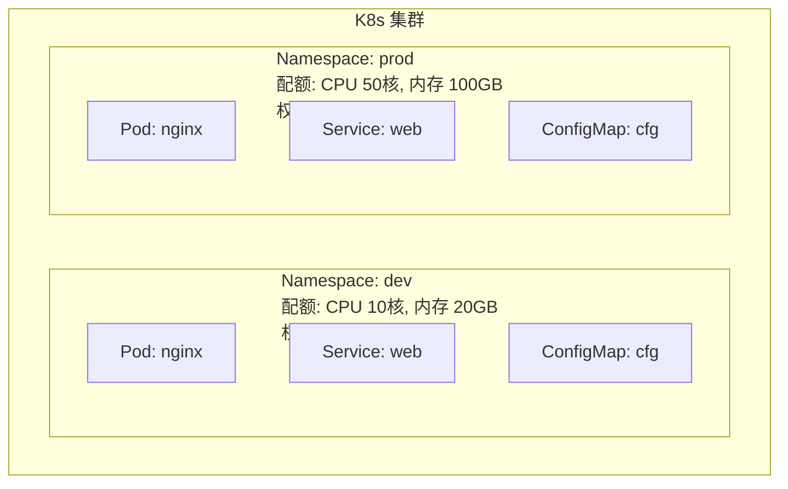

# API 基础

记录 K8s API 设计、Label / Selector 机制、Namespace 隔离等基础知识。

## 知识点

## API 设计 <2026-06-17>

**场景**：学习 K8s RESTful API 的统一设计模式。

**三种访问方式**：kubectl / Dashboard UI / 直接 curl API Server，底层都是 HTTP 请求。

**URL 格式**：`/api/v1/namespaces/{ns}/pods/{name}`

**所有资源统一的 YAML 四字段结构**：

| 字段 | 作用 | 示例 |
|------|------|------|
| `apiVersion` | API 版本 | `v1`, `apps/v1`, `networking.k8s.io/v1` |
| `kind` | 资源类型 | `Pod`, `Service`, `Deployment` |
| `metadata` | 元数据 | `name`, `labels`, `namespace` |
| `spec` | 规格定义 | `containers`, `replicas` |

---

## Label 与 Selector <2026-06-17>

**场景**：K8s 的松耦合核心机制——资源不靠硬编码关联，全凭 Label 匹配。

```mermaid
flowchart LR
    subgraph Pods["Pod 集群"]
        A["Pod: apple<br/>labels: { color: red, app: frontend }"]
        B["Pod: banana<br/>labels: { color: yellow, app: frontend }"]
        C["Pod: strawberry<br/>labels: { color: red, app: backend }"]
    end

    S["Selector: color=red"] --> A
    S --> C
    B -.-X S
```

**典型用法**：
- Service 用 `app=nginx` 找到对应的 Pod
- Deployment 用相同的 Label 管理自己的 ReplicaSet
- `kubectl get pods -l env=prod` 筛选 prod 环境的所有 Pod

**常用 Label**：`app`, `tier`, `env`, `version`, `component`

---

## Namespace <2026-06-17>

**场景**：同一集群内划分逻辑租户，用于环境隔离、资源配额、权限管控。



**核心规则**：
1. 同一 Namespace 内资源名唯一
2. 不同 Namespace 可重名（dev 和 prod 都有 nginx）
3. 跨 Namespace 访问需显式指定：`nginx.dev.svc.cluster.local`
4. RBAC 可限制用户只能操作特定 Namespace
