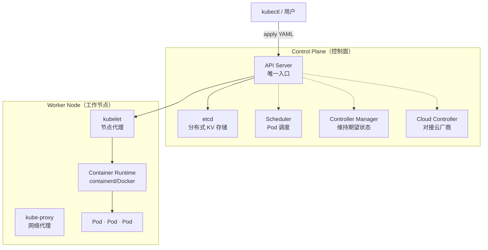
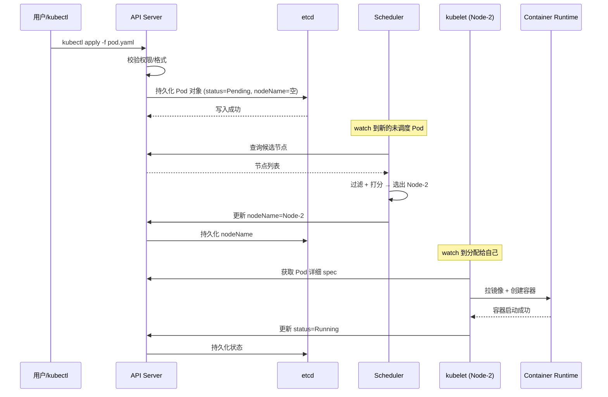
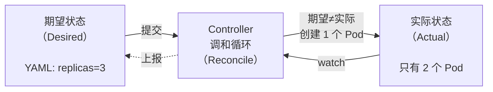

# K8s 架构

记录 Kubernetes 集群架构、Control Plane（Master）组件、Pod 创建全链路、声明式 API 调和循环等知识。

## 知识点

## 集群架构全景 <2026-06-17>

**场景**：系统性学习 K8s 集群架构，理解 Control Plane 与 Worker Node 的分工与协作。



**核心设计原则**：所有组件只与 API Server 通信，组件之间不直接互相调用——松耦合、异步、watch 事件驱动。

**组件清单**：

| 组件 | 位置 | 职责 |
|------|------|------|
| API Server | Control Plane | 集群唯一入口，认证/鉴权/校验 |
| etcd | Control Plane | 分布式 KV 存储（Raft 共识），所有对象真实状态 |
| Scheduler | Control Plane | 为未调度 Pod 选节点（过滤+打分） |
| Controller Manager | Control Plane | 持续对比期望 vs 实际状态 |
| Cloud Controller | Control Plane | 对接云厂商 API（可选） |
| kubelet | Worker Node | 节点代理，watch API Server 并启容器 |
| kube-proxy | Worker Node | 维护 iptables/IPVS 规则，Service 流量转发 |
| Container Runtime | Worker Node | 拉镜像、创建/销毁容器 |

---

## Pod 创建全链路 <2026-06-17>

**场景**：跟踪一个 Pod 从 `kubectl apply` 到容器运行的完整流程。



**精髓**：所有组件松耦合，通过 API Server → etcd → watch 事件这条总线传递信息。Scheduler 不直接调 kubelet，kubelet 不直接调 Scheduler。

---

## 声明式 API 调和循环 <2026-06-17>

**场景**：理解 K8s 声明式 API 的核心——描述"终点"而非"怎么做"。



**核心思想**：用户只声明「我要 3 个 nginx」，Controller 持续驱动实际趋近期望——多退少补、挂了自动补、改了自动调。

**YAML 四字段结构**：

```yaml
apiVersion: apps/v1   # API 版本
kind: Deployment      # 资源类型
metadata:             # 元数据（name/labels/namespace）
  name: nginx
spec:                 # 规格定义（期望值）
  replicas: 3
  template: ...
```
