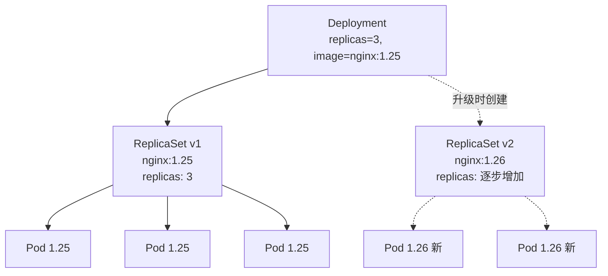
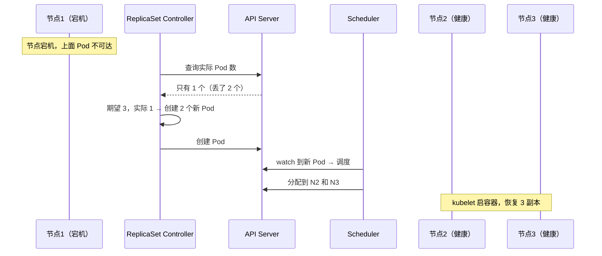
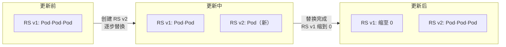

# Deployment

记录 Deployment 配置、滚动更新、回滚策略、自愈机制等知识。

## 知识点

## Deployment 两层结构 <2026-06-17>

**场景**：学习 Deployment → ReplicaSet → Pod 的层级关系。

Deployment 管版本（镜像 tag），ReplicaSet 管数量（副本数），ReplicaSet 才是直接数 Pod 个数的那个。

---

## 自愈（Self-healing） <2026-06-17>

**场景**：理解 Deployment 如何自动恢复故障 Pod。

全程自动完成，无需人工干预——这就是声明式 API 的力量。

---

## 滚动更新（Rolling Update） <2026-06-17>

**场景**：更新镜像版本时，如何做到零停机。

**关键机制**：
- Deployment 创建新 ReplicaSet（v2）
- 新 ReplicaSet 逐步扩容，旧 ReplicaSet 逐步缩容
- 中间时段新旧 Pod 共存，服务不中断
- 出问题 → `kubectl rollout undo` 一键回滚（旧 ReplicaSet 还在！）
