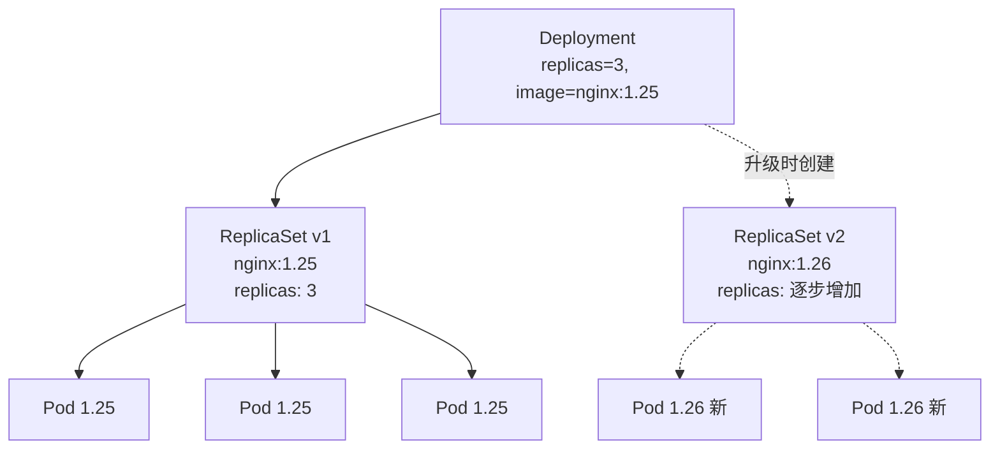
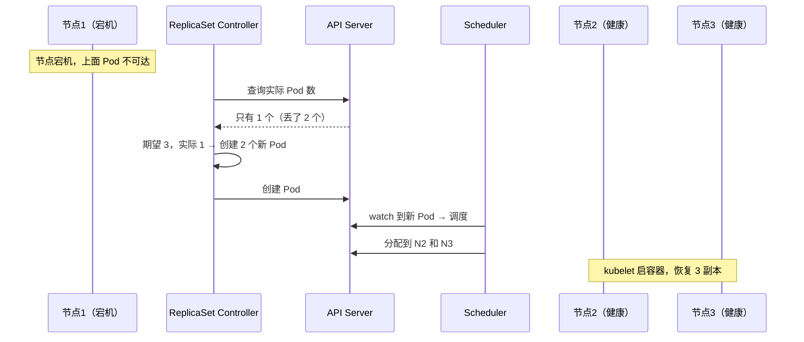
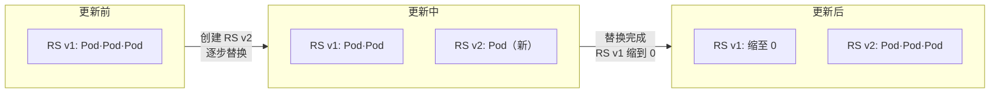

# Deployment

记录 Deployment 配置、滚动更新、回滚策略、自愈机制等知识。

## 知识点

## Deployment 两层结构 <2026-06-17>

**场景**：学习 Deployment → ReplicaSet → Pod 的层级关系。

Deployment 管版本（镜像 tag），ReplicaSet 管数量（副本数），ReplicaSet 才是直接数 Pod 个数的那个。


```mermaid
flowchart TB
    D["Deployment<br/>replicas=3, image=nginx:1.25"]
    D --> RS1["ReplicaSet v1<br/>nginx:1.25<br/>replicas: 3"]
    D -.->|升级时创建| RS2["ReplicaSet v2<br/>nginx:1.26<br/>replicas: 逐步增加"]
    RS1 --> P1["Pod 1.25"]
    RS1 --> P2["Pod 1.25"]
    RS1 --> P3["Pod 1.25"]
    RS2 -.-> P4["Pod 1.26 新"]
    RS2 -.-> P5["Pod 1.26 新"]
```

---

## 自愈（Self-healing） <2026-06-17>

**场景**：理解 Deployment 如何自动恢复故障 Pod。


```mermaid
sequenceDiagram
    participant N1 as 节点1（宕机）
    participant RC as ReplicaSet Controller
    participant API as API Server
    participant S as Scheduler
    participant N2 as 节点2（健康）
    participant N3 as 节点3（健康）

    Note over N1: 节点宕机，上面 Pod 不可达
    RC->>API: 查询实际 Pod 数
    API-->>RC: 只有 1 个（丢了 2 个）
    RC->>RC: 期望 3，实际 1 → 创建 2 个新 Pod
    RC->>API: 创建 Pod
    S->>API: watch 到新 Pod → 调度
    S->>API: 分配到 N2 和 N3
    Note over N2,N3: kubelet 启容器，恢复 3 副本
```

全程自动完成，无需人工干预——这就是声明式 API 的力量。

---

## 滚动更新（Rolling Update） <2026-06-17>

**场景**：更新镜像版本时，如何做到零停机。


```mermaid
flowchart LR
    subgraph Before["更新前"]
        B1["RS v1: Pod·Pod·Pod"]
    end
    subgraph During["更新中"]
        D1["RS v1: Pod·Pod"]
        D2["RS v2: Pod（新）"]
    end
    subgraph After["更新后"]
        A1["RS v1: 缩至 0"]
        A2["RS v2: Pod·Pod·Pod"]
    end
    Before -->|"创建 RS v2<br/>逐步替换"| During -->|"替换完成<br/>RS v1 缩到 0"| After
```

**关键机制**：
- Deployment 创建新 ReplicaSet（v2）
- 新 ReplicaSet 逐步扩容，旧 ReplicaSet 逐步缩容
- 中间时段新旧 Pod 共存，服务不中断
- 出问题 → `kubectl rollout undo` 一键回滚（旧 ReplicaSet 还在！）

---

## StatefulSet 滚动更新死锁 <2026-09-15>

**场景**：给 StatefulSet 的 pod 模板加了 toleration 后，pending 的 pod 依然没生效新模板，调度还是报同样的错。

**现象**：Deployment 加 toleration 后 pod 自动重建生效；StatefulSet 加同样的 toleration 却没用。

**原理（死锁）**：StatefulSet 滚动更新**只替换 Running + Ready 的 pod**。一个卡在 Pending 的 pod（不 Ready）会被控制器判定为「不能动」，于是永远不套用新模板：

```text
pod 因缺容忍 → Pending → 不 Ready
        ↓
StatefulSet 看它不 Ready → 拒绝滚动更新 → 永不套用新模板
        ↓
新模板里的容忍永远不生效 → pod 永远 Pending
```

**诊断信号**：

```bash
kubectl get statefulset <sts> -n <ns> -o yaml
# 看 status.currentRevision != status.updateRevision，且 currentReplicas > 0
```

`currentRevision` = 旧模板（无容忍），`updateRevision` = 新模板（有容忍），说明有 pod 卡在旧 revision。

**解法**：手动删 pending pod，强制用新 revision 重建：

```bash
kubectl delete pod <sts>-0 -n <ns>
```

Deployment 会自动重建 pending pod，StatefulSet 不会——这是两者关键差异。

**额外坑**：StatefulSet 的 `serviceName` 是必填项，必须指向 `clusterIP: None` 的 Headless Service，否则 pod 拿不到稳定 hostname/DNS 身份（固定 IP 依赖它）。空 `serviceName: ""` 不挡调度，但会破坏固定身份。
