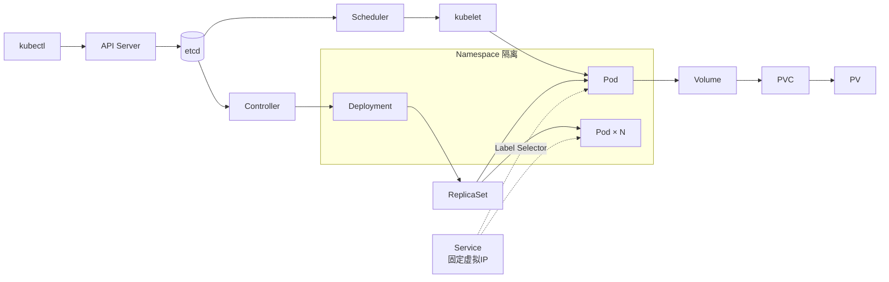

# ☸️ Kubernetes 知识

## 分类

- [架构](/topics/k8s/architecture/) - Control Plane / Master / etcd / Scheduler / Controller
- [API 基础](/topics/k8s/api/) - API 设计 / Label & Selector / Namespace
- [Node](/topics/k8s/node/) - 节点管理与调度
- [Deployment](/topics/k8s/deployment/) - 部署与滚动更新
- [Pod](/topics/k8s/pod/) - Pod 生命周期与配置
- [PV/PVC](/topics/k8s/pv-pvc/) - 持久化存储
- [Service](/topics/k8s/service/) - 服务发现与负载均衡
- [GPU 工作负载](/topics/k8s/gpu/) - GPU device plugin、qGPU 切片、TCE 排障

## 最近更新

## K8s 核心概念速查（2026-06-17 学习）

| 概念 | 一句话 |
|------|--------|
| API Server | 集群唯一入口，所有操作必经 |
| etcd | 集群内存，存所有对象的真实状态 |
| Controller | 持续对比期望 vs 实际，趋近期望 |
| Scheduler | 为 Pod 选节点（过滤 + 打分） |
| kubelet | 节点代理，watch + 启容器 |
| Pod | 最小调度单元，共享网络和存储 |
| Deployment | 管理 Pod 版本和副本数 |
| ReplicaSet | 维持指定数量的 Pod 副本 |
| Service | 稳定虚拟 IP，Pod 随便换外面无感知 |
| Namespace | 逻辑租户隔离 |
| Label/Selector | 松耦合关联机制 |

---

- **2026-06-17** [K8s 11 个核心概念系统性学习](/topics/k8s/architecture/) —— 架构、Pod、Deployment、Service、Volume/PV-PVC、API、Label/Selector、Namespace 全覆盖
- **2026-05-07** [TCE + qGPU 工作负载从 0 到跑通全流程](/topics/k8s/gpu/) —— NVML Unknown Error、qGPU 切片、namespace label、Pod 诊断、后台运行方案
- **2026-05-07** [Pod 未就绪的三板斧诊断](/topics/k8s/pod/)
- **2026-05-07** [污点与容忍度](/topics/k8s/node/)、[查看节点 GPU 资源](/topics/k8s/node/)

