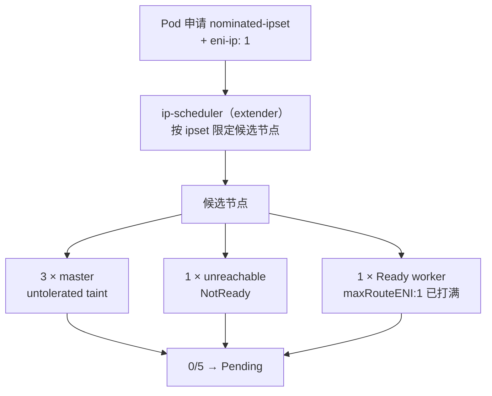

# Node

记录 K8s 节点管理、调度策略、污点容忍等知识。

## 知识点

## 污点（Taint）与容忍度（Toleration） <2026-05-07>

**场景**：创建 GPU 工作负载时，想让 Pod 能调度到带污点的节点上。

**要点**：

```bash
# 快速查所有节点的污点
kubectl get nodes -o custom-columns=NAME:.metadata.name,TAINTS:.spec.taints
```

- 节点 `TAINTS: <none>` → **不需要配 tolerations**，直接部署即可
- 节点有污点 `key=value:effect` → Pod spec 里用 `tolerations` 精确匹配（或 `operator: Exists` 宽匹配）

**effect 三种**：

| effect | 新 Pod | 已运行 Pod |
|---|---|---|
| `NoSchedule` | ❌ 不来 | ✅ 不动 |
| `PreferNoSchedule` | ⚠️ 尽量别来 | ✅ 不动 |
| `NoExecute` | ❌ 不来 | ❌ 驱逐（无 toleration 时）|

**经典例子** `node-role.kubernetes.io/master:NoSchedule`：K8s 默认给 master 加的污点，防业务 Pod 占用 master 影响控制平面。小集群可能会移除让 master 兼做 worker，方便但有风险。

**容忍度 vs 节点选择器的区别**：
- `tolerations`：「**允许**调度到有污点的节点」——解锁权限
- `nodeSelector` / `nodeAffinity`：「**必须**调度到满足条件的节点」——强制规则

两者经常配合使用。

---

## 查看所有节点 GPU 资源分布 <2026-05-07>

**场景**：想看集群里哪些节点有 GPU、分了多少、剩多少。

**要点**：

```bash
# 标准 GPU device plugin
kubectl describe nodes | grep -E "Name:|nvidia.com/gpu"

# qGPU（腾讯 TKE 切片方案）
kubectl describe nodes | grep -E "Name:|qgpu"

# JSON 结构化输出
kubectl get nodes -o json | jq -r '.items[] | "\(.metadata.name)  capacity=\(.status.capacity["nvidia.com/gpu"] // "0")  allocatable=\(.status.allocatable["nvidia.com/gpu"] // "0")"'
```

**注意**：`nvidia-smi` 只能看本机的 GPU。Pod 可能调度到别的节点上，**想看 Pod 实际 GPU 负载必须 SSH 到 Pod 所在节点**：

```bash
NODE=$(kubectl get pod -n <ns> <pod> -o jsonpath='{.spec.nodeName}')
ssh $NODE 'nvidia-smi -l 1'
```

---

## Taint/Toleration 的设计动机 <2026-09-15>

**场景**：理解 K8s 为什么同时有 nodeSelector 和 taint/toleration 两套机制，而不合并成一个。

**一句话**：Taint/Toleration 解决的是 nodeSelector 做不到的问题——**节点「拒绝」谁**，而不是 Pod「选择」去哪。

**本质对比**：

| 机制 | 方向 | 谁配 | 语义 | 局限 |
|---|---|---|---|---|
| nodeSelector / affinity | 拉 | 写 Pod 的人 | 我想去有某标签的节点 | 管不住别人占我的节点 |
| Taint / Toleration | 拒 | 管节点的人 | 没钥匙的 Pod 别来 | — |

**核心是 allowlist（白名单）模型**：默认拒绝、显式放行。所以 master 打上 `NoSchedule` 污点，就能挡住所有业务 Pod，而不需要求每个开发者「自觉避开 master」。

**职责分离**：节点归管理员管（打 taint），Pod 归开发者管（写 toleration），运行时 **key + effect 配对即放行**。

**匹配细节**：空 value 的污点（如 `node-role.kubernetes.io/master:`）用 `operator: Exists` 匹配（不关心 value），比 `Equal` 更省心。

---

## TCE 集群 Pod 调度失败排障（ENI-IP / ipset） <2026-09-15>

**场景**：TCE 3.10 TKE 集群，Deployment/StatefulSet 的 Pod 一直 Pending，事件报
`0/5 nodes are available: 1 Insufficient tke.cloud.tencent.com/eni-ip, 1 [ip-scheduler] InsufficientIPorENI + ENILimitExceed, 1 unreachable taint, 3 master taint`。

**核心方法论**：

1. **`0/N` 的 N 是 feasible 候选节点数，不是集群节点总数**。先 `kubectl get nodes` 看真实规模再下结论。失败原因计数可重叠（同一节点可能同时 master 污点 + eni 不足），相加可能 > N。
2. **多集群环境先确认 kubectl 上下文**：hostname 变化（`tcs-*` → `VM_*`）是切集群的信号。本次一度拿 40 节点列表分析，实际是另一套集群。
3. **排障顺序**：`get nodes` → 找 Pending pod → `get pod -o yaml` 看 annotation → `api-resources | grep` 找 CRD → 查 CRD 对象。

**TCE 网络 CRD 模型**（`networking.tke.cloud.tencent.com/v1`）：

| CRD | 简称 | 作用 |
|---|---|---|
| IPSet | ipset | underlay 固定 IP 集合 |
| VpcIP / VpcIPClaim | vip / vipc | 实际 IP / 申请凭据 |
| VpcENI | veni | VPC 弹性网卡 |
| NodeENIConfig | nec | 节点 ENI 配置（cluster-scoped） |

**关键定位手段**：

- Pod annotation `tke.fsphere.com/nominated-ipset: <name>` = 申请 underlay 固定 IP，是 ip-scheduler（挂在 default-scheduler 后的 scheduler extender）注入的调度约束。
- NEC 存子网用 **CIDR**（`subnetCIDR: 10.12.123.0/24`），不是 subnet ID（`subnet-xxx`）→ grep subnet ID 永远为空，别误判「没节点接该子网」。
- `ENILimitExceed` 比 `InsufficientIPorENI` 更明确：候选节点的 ENI 挂载数已达到上限。

**根因（本次）**：唯一健康 worker 是**小规格**（NEC `maxRouteENI:1 / maxIPPerENI:9` → 单节点最多 9 个 pod IP），其唯一 ENI 已打满；3 个 master 和失联 worker 都是大规格（`maxRouteENI:3`）。ipset 本身健康（`requestIPNum:10` 已全部分配、`Ready=True`），瓶颈在「承载 IP 的节点 ENI 容量」，不是 IP 池耗尽。

**完整调度链路**：



**修复**：

- 临时（测试集群）：给 pod 模板加 master 容忍（`node-role.kubernetes.io/master` + `control-plane`，`operator: Exists, effect: NoSchedule`），落到大规格 master 上。
- 根治：救活失联 worker，或给唯一 worker 换大规格 / 扩 ENI 容量。

---

