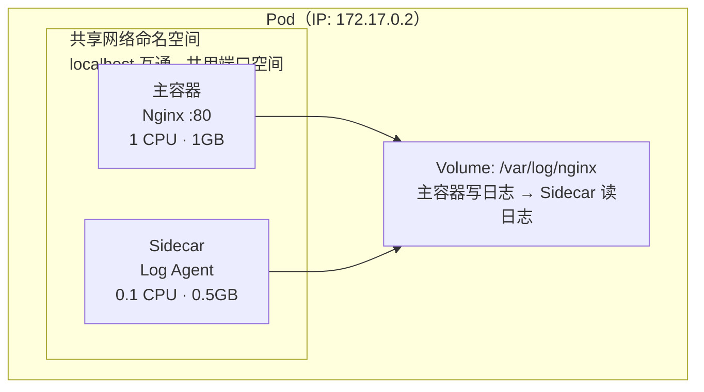
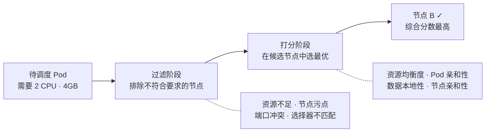

# Pod

记录 Pod 生命周期、容器共享机制、Sidecar 模式等知识。

## 知识点

## 核心概念 <2026-06-17>

**场景**：系统性学习 Pod 作为 K8s 最小调度单元的设计理念。

Pod 是**容器的「机箱」**——把一组紧密协作的容器装在一起，给它们共享的网络和存储。

**三个关键点**：

1. **IP 是 Pod 级别的，不是容器的**：Pod 内所有容器共用同一个 IP，用 `localhost` 通信。一个 Pod 内不能两个容器抢同一个端口。

2. **Volume 是共享的**：主容器写日志到 Volume，Sidecar 直接读——不走网络、不走内存拷贝，文件就是通信媒介。

3. **同生同死、一起调度**：调度器把 Pod 作为整体分配，不会被拆散到不同节点。重启时一起重建，不适合放独立服务。

**常见 Sidecar 模式**：日志采集（Filebeat）、服务注册（Consul Agent）、代理转发（Envoy）

---

## 调度器工作原理 <2026-06-17>

**场景**：理解 Scheduler 如何为 Pod 选择最优节点（不只是「找空闲机器」）。

**调度不是「谁空就放谁」**，而是先排除不合要求的（不足资源、有 Taint），再在候选节点中打分（资源均衡、数据就近、亲和匹配），选出最优。
