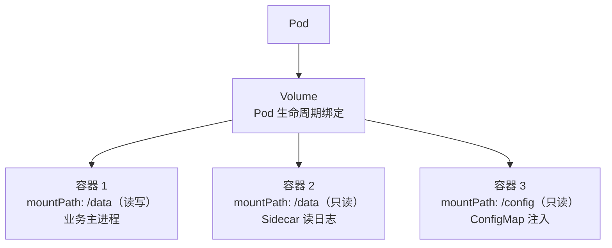
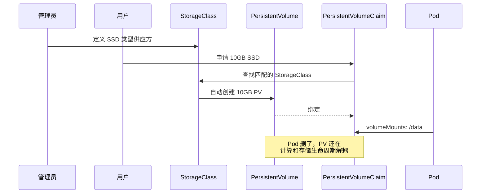

# PV / PVC

记录持久卷、存储类、动态供给、绑定策略、Volume 类型等知识。

## 知识点

## Volume 核心概念 <2026-06-17>

**场景**：学习 Kubernetes Volume 作为存储抽象层的设计。

Volume 是 Pod 级别的存储抽象：容器只看到目录路径（如 `/data`），不关心实际数据存在哪。

**常用 Volume 类型**：

| 类型 | 用途 | 生命周期 |
|------|------|----------|
| `emptyDir` | 容器间临时共享 | 与 Pod 同生同死 |
| `hostPath` | 挂载宿主机目录 | 独立于 Pod |
| `ConfigMap` | 配置注入 | 独立于 Pod |
| `Secret` | 密钥/证书注入 | 独立于 Pod |
| `PVC` | 持久化存储 | 独立于 Pod |

**核心价值**：容器内统一用 mount 机制，不区分"配置文件"还是"数据目录"——都是文件系统路径。

---

## PV / PVC / StorageClass 动态供给 <2026-06-17>

**场景**：理解 K8s 持久化存储的三层角色分离。

**角色分工**：
- **管理员**：定义 StorageClass（"我有 SSD 和 HDD 两种供应"）
- **用户**：创建 PVC（"我要 10G SSD"）
- **K8s**：自动匹配 → 动态创建 PV → 绑定

支持后端：AWS EBS、GCE PD、NFS、Ceph、local-volume、CSI 驱动等。
