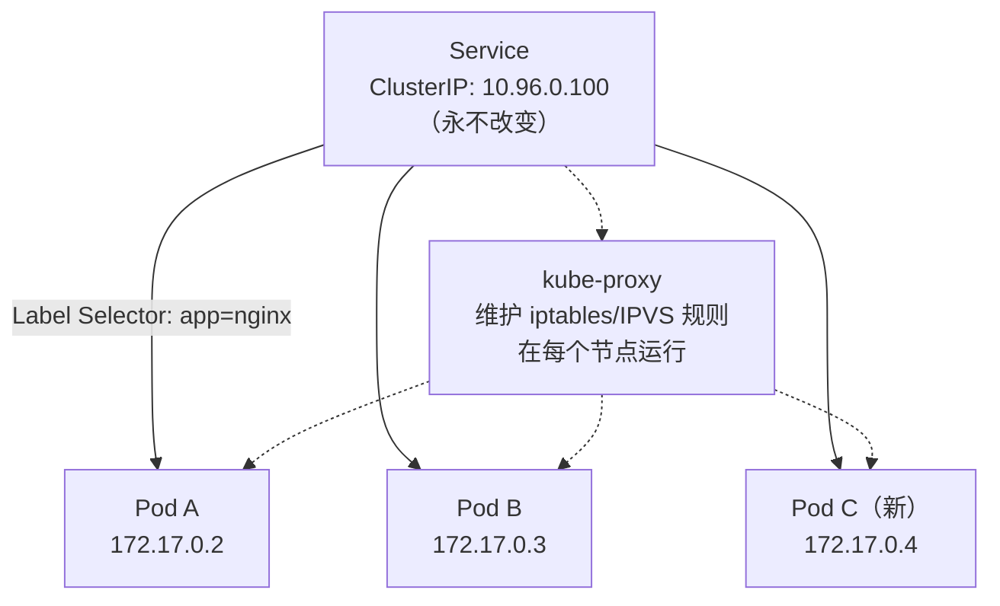
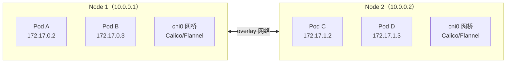
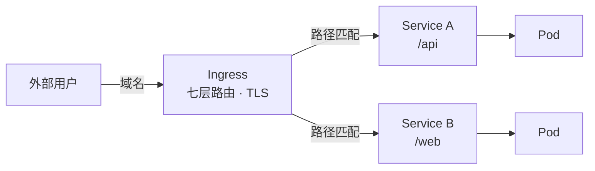
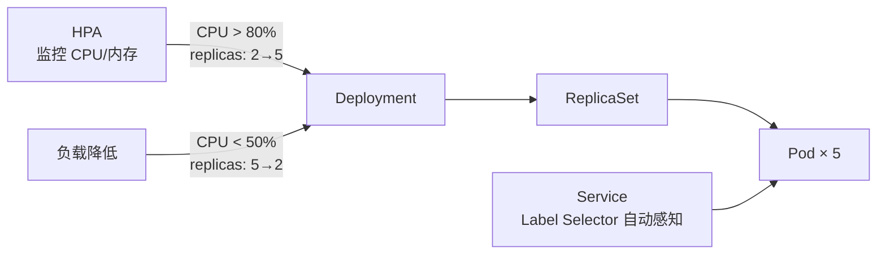

# Service

记录 Service 类型、负载均衡、服务发现、Ingress 路由、网络模型等知识。

## 知识点

## Service 核心价值 <2026-06-17>

**场景**：理解为什么 Pod IP 不能用，Service 如何解决。

Pod 销毁重建 IP 变、扩缩容 IP 变多变少——不能直接用 Pod IP 做服务调用。Service 提供一个**永不改变的虚拟 IP（ClusterIP）**。

**三种暴露方式**：

| 类型 | 使用场景 | 示例 |
|------|----------|------|
| ClusterIP（默认） | 集群内部访问 | `10.96.0.100:80` |
| NodePort | 外部直连节点 | `<任意节点IP>:30001` |
| LoadBalancer | 云厂商 LB | 公网 IP 自动分配 |

---

## K8s 网络模型 <2026-06-17>

**场景**：理解 Pod 跨节点通信的原理。

**K8s 三大网络铁律**：
1. 每个 Pod 有独立 IP（没有端口冲突问题）
2. Pod 可以跨节点直接通信（无需 NAT）
3. Node IP 与 Pod IP 互通

**外部访问链路**：

---

## HPA 自动扩缩 <2026-06-17>

**场景**：业务负载波动时，HPA 自动调整副本数 + Service 自动感知。

pod 扩缩、Service 自动感知新 Pod、自动负载均衡——全自动。
